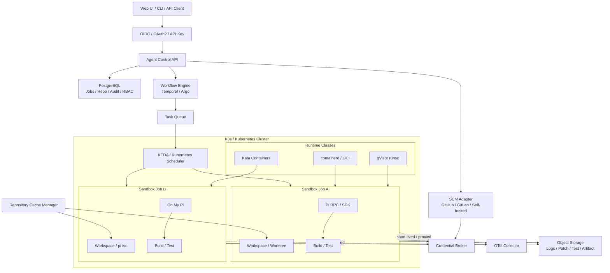
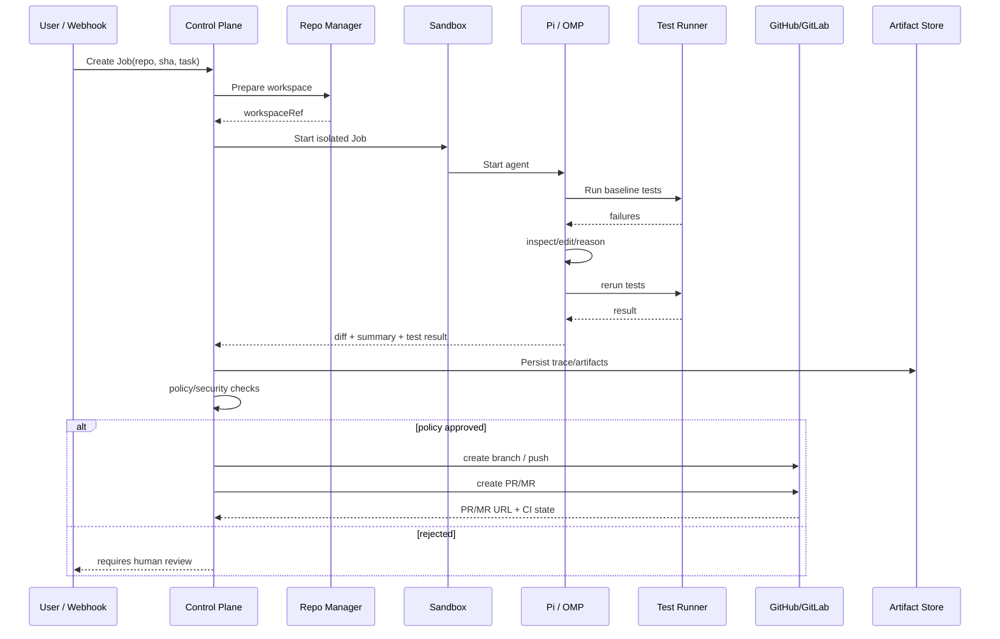

# 基于 Pi / Oh My Pi 的轻量化容器沙盒集群：架构、选型、安全与落地研究报告

## 执行摘要

你的目标最适合采用**“控制面 + 一次性 Agent Sandbox 数据面”**的架构：控制面只负责任务、身份、仓库、凭据代理、调度与审计，每个代码任务则在独立的容器、gVisor Sandbox 或 Kata/Firecracker 微虚机中运行一个 Pi/Oh My Pi 实例。Pi 官方明确说明自身**不提供内建安全沙盒**，其 shell、文件工具和扩展与 Pi 进程拥有同等系统权限，因此生产环境不能把 Pi 本身当作安全边界。citeturn21view2turn17search2

**推荐的总体路径是：MVP 用单机 rootless Docker/Podman + Pi RPC + PostgreSQL/轻量队列；小型生产集群用 K3s + containerd + gVisor + KEDA；高风险、多租户或执行外部仓库时升级到 Kata Containers 4 / Firecracker。** Kubernetes 的 RuntimeClass 可以按任务选择不同运行时，因此低风险任务跑普通 OCI/gVisor，高风险任务跑 Kata，无需把所有任务都付出 VM 级成本。citeturn18search0turn15search4turn18search13turn17search0turn16search3turn20search5

Pi 与 Oh My Pi 不建议“硬融合”为同一个运行时；更稳妥的做法是定义统一 `AgentDriver`，把 **Pi RPC、Pi SDK、OMP SDK/CLI** 作为可替换后端。Pi RPC 本身就是面向 headless、自定义 UI 和自动化场景设计的 JSONL stdin/stdout 协议，并支持 prompt、steer、follow-up、abort、session 等操作；OMP 则额外提供 subagent、批量 fan-out、并发 semaphore、worktree/`pi-iso` 隔离和作业管理能力。citeturn22view0turn14search6turn21view1

最终建议的生产栈是 **K3s/Kubernetes + gVisor/Kata RuntimeClass + Temporal 或 Argo Workflows + KEDA + PostgreSQL + S3 兼容对象存储 + OpenTelemetry + Prometheus/Grafana/Loki + OIDC**；仓库层采用“节点本地 Git mirror/cache + 任务级 worktree/sparse/partial clone”，凭据由控制面短时下发或代理，而不是长期放进 Agent Sandbox。citeturn3search1turn15search6turn14search2turn15search9turn19search4turn19search9turn19search6

## 目标、约束与需求基线

你的业务目标已经很明确：批量执行代码任务、同时管理多个仓库、运行测试、自动修改代码、修复 bug、生成 PR/MR，并允许通过网页/API 操纵 Agent。真正尚未确定的，是**规模、威胁模型和 SLA**；这三项将直接决定到底使用普通容器、gVisor 还是 VM 级隔离。

下表把没有给出的约束统一标记为“**未指定**”，并给出我建议用于第一版容量规划的工程基线。表中的建议值是设计起点，不是 Pi/OMP 的产品限制。

| 维度 | 当前需求/约束 | 建议基线 |
|---|---|---|
| 主要工作负载 | 大量代码任务、测试、修 bug、PR | 一次任务 = 一个逻辑 Job，一个 Job 可含多个 Agent step |
| 仓库数量 | **未指定** | 架构按数百至数千仓库设计；仓库 metadata 与 workspace 解耦 |
| 单任务时长 | **未指定** | 软超时 20–30 分钟，硬超时 60 分钟；长任务交由 Temporal/Argo |
| 性能 SLA | **未指定** | 重点监控 queue wait、sandbox startup、checkout、test、agent latency 的 p50/p95/p99 |
| 最大并发 | **未指定** | MVP 4–16；小型生产 20–100；通过 KEDA/节点池扩展 |
| CPU 配额 | **未指定** | 普通代码任务初始 `1–2 vCPU` |
| 内存配额 | **未指定** | 初始 `2–4 GiB`；JVM/大型 TS/编译任务单独 profile |
| 临时磁盘 | **未指定** | 普通任务 10–20 GiB；大型 monorepo 50 GiB+ |
| PID 数量 | **未指定** | 建议限制 256–1024，而不是无限 |
| 隔离级别 | **未指定** | 内部可信代码：gVisor；外部/不可信仓库：Kata/Firecracker |
| 多租户 | **未指定** | 数据模型从第一天加入 `tenant_id`，即使初期单租户 |
| root 权限 | 不应需要 | Sandbox 内非 root、宿主不授予 privileged |
| 网络需求 | Git、模型 API、依赖仓库 | 默认 deny；按任务 profile 开放模型代理、SCM 和 package registry |
| Internet 任意访问 | **未指定** | 默认禁止 |
| 内网访问 | **未指定** | 默认禁止，尤其 RFC1918、link-local、metadata endpoint |
| 持久化 workspace | **未指定** | 默认不持久化完整 workspace，只留 diff、commit、日志、报告和 session |
| Git cache | 需要 | 节点本地 mirror/object cache，可丢弃重建 |
| Package cache | 需要 | 按语言/lockfile/toolchain 版本分键 |
| 日志保存期限 | **未指定** | MVP 7–30 天；生产按合规要求配置 |
| 审计保存期限 | **未指定** | 建议显著长于普通日志 |
| Agent session 保存 | **未指定** | 保存结构化 transcript，敏感字段脱敏 |
| CI/CD | GitHub/GitLab/自托管 | Forge adapter，不在业务逻辑里硬编码 GitHub |
| PR 自动创建 | 是 | 自动 branch/push/PR；自动 merge 建议另设审批策略 |
| 自动合并 | **未指定** | 初期关闭 |
| SCM 权限模型 | **未指定** | GitHub App / GitLab service identity，而非开发者 PAT |
| 用户认证 | **未指定** | OIDC |
| API 自动化认证 | **未指定** | OAuth client credential / scoped API key |
| RBAC | **未指定** | viewer / operator / maintainer / admin |
| 合规要求 | **未指定** | 若涉及 SOC 2、ISO 27001、金融/医疗，应额外设计审计与数据边界 |
| 数据驻留地区 | **未指定** | 需要在选择云与模型提供商前明确 |
| LLM Provider | **未指定** | 通过 Pi/OMP provider abstraction 解耦 |
| 预算 | **未指定** | 采用“每 Job infra 成本 + model token 成本”双重计量 |
| RPO/RTO | **未指定** | metadata DB 建议明确；Git mirror 本身可以重建 |

资源限制必须显式设置，因为 Docker 默认不自动给容器设置 CPU/内存上限，而 Kubernetes 可以通过 requests/limits、ResourceQuota 和 namespace 配额控制消耗。citeturn18search12turn18search5turn18search37

一个重要的需求定义是：

> **“代码执行安全域”和“SCM 写权限安全域”必须分开。**

原因是 Agent 所读取的 README、Issue、源码、测试输出都可能成为提示注入来源；Pi 官方也明确指出项目 trust 机制并不能让不可信 prompt 或代码变安全。citeturn21view2 因此生产设计应该允许 Agent 修改 `/workspace`、运行测试，却尽可能**拿不到长期 GitHub/GitLab 写 token**；最终 push/PR 由控制面的 Credential Broker / SCM Adapter 完成。这一模式与 OMP `pi-metaharness` 当前采用的“认证信息留在宿主/网关，容器通过代理访问模型”的设计原则一致。citeturn21view3

## 推荐架构与 Pi / Oh My Pi 集成

Pi 当前提供 extensions、skills、prompt templates、packages、SDK 以及 RPC 等扩展方式，SDK 官方定位就包括自定义 UI 和 automated pipeline；RPC 则直接为 headless embedding 提供 stdin/stdout JSONL 接口。citeturn0search3turn17search2turn22view0 这意味着**不要修改 Pi core 来做集群**，而应在 Pi 外面增加 scheduler/control plane。

推荐架构如下：



Kubernetes `RuntimeClass` 本来就是为 Pod 选择不同容器运行时配置而设计，因此可以把 `sandbox-standard -> runsc`、`sandbox-high -> kata` 映射为两种安全等级，而不要求开发者修改 Agent。citeturn18search13

**Pi 集成建议。** 控制面启动：

```bash
pi --mode rpc \
  --session-dir /workspace/.agent-session \
  --provider "$PI_PROVIDER" \
  --model "$PI_MODEL"
```

然后通过 stdin 写入严格的 JSONL：

```json
{"id":"job-123","type":"prompt","message":"运行测试，定位失败原因并修复。不要提交或推送代码。"}
```

需要人工干预时：

```json
{"id":"job-123-steer-1","type":"steer","message":"不要修改公共 API，优先修复解析器。"}
```

取消：

```json
{"id":"job-123-abort","type":"abort"}
```

这些 command 和 `pi --mode rpc` 都是当前 Pi 官方 RPC 接口，事件则持续从 stdout 以 JSONL 流出。citeturn22view0

对于 Node/TypeScript 控制面，Pi 官方实际上建议可以直接使用 `AgentSession` SDK；不过在集群服务中，我仍更倾向于**默认 RPC 子进程模式**，因为 crash、依赖升级和 Agent 生命周期与控制面天然隔离。Pi 官方 RPC 文档同时明确给出了 SDK 直接 embedding 与 subprocess 两条路径。citeturn22view0turn17search2

建议定义内部接口：

```ts
interface AgentDriver {
  start(job: AgentJob): Promise<AgentHandle>;
  prompt(id: string, text: string): Promise<void>;
  steer(id: string, text: string): Promise<void>;
  cancel(id: string): Promise<void>;
  events(id: string): AsyncIterable<AgentEvent>;
  snapshot(id: string): Promise<AgentSnapshot>;
}
```

并实现：

```text
PiRpcDriver
PiSdkDriver
OmpSdkDriver
OmpCliDriver
```

这样 OMP 不会侵入 scheduler、API、SCM 或日志模型。

**Oh My Pi 的定位应是“增强型 Agent runtime”，而不是集群调度器。** OMP 当前提供 `@oh-my-pi/pi-coding-agent` SDK；其 task 系统已有批量 subagent、异步 job manager、session-scoped semaphore、agent registry、运行时限制和 isolated workspace 支持，并通过 `pi-iso` 管理隔离工作目录。citeturn14search0turn14search6turn21view1 因此适合把复杂任务在**一个 Kubernetes Job 内进一步 fan-out**，而全集群容量仍由外层 scheduler 控制。

换言之，推荐两级并发：

```text
集群级并发
Kubernetes / KEDA / Temporal
        │
        ├── Job A: OMP maxConcurrency=4
        │       ├── scout
        │       ├── test
        │       ├── fix
        │       └── review
        │
        └── Job B: Pi single agent
```

OMP 的 `task.maxConcurrency` 确实由 session-scoped semaphore 限制，并可以对 isolated task 创建、清理 workspace、捕获 patch。citeturn21view1 但这**不能替代 OS/VM 安全边界**：OMP extensions 与 Agent 本身仍属于进程权限域；其快速演进的隔离实现也存在关于 mount/overlay 生命周期等公开讨论，因此生产环境应把 `pi-iso` 理解为“工作区隔离/并行开发工具”，而不是最终 hostile-code sandbox。citeturn1search1turn1search3turn1search11

**OMP 现有代码中有两个特别值得借鉴的项目。** `pi-metaharness` 已经实现统一 run/trace 模型、SQLite、REST/SSE API、dashboard、并发 batch runner，并采用“容器不接触模型凭据”的 host auth gateway 模式；它非常适合作为批量任务控制面的参考实现。citeturn21view3 `robomp` 则已经包含 Docker Compose、GitHub webhook、仓库 allowlist、bot 权限和健康检查等自动化组件，更接近“GitHub Agent Bot”原型。citeturn14search15 但二者目前更适合作为**代码资产/原型加速器**，而不是直接视为通用多租户生产平台。

**Git 工作区方案**建议区分两种信任模式。Git 官方的 `worktree` 允许同一 repository 同时拥有多个 working tree；`sparse-checkout` 可以只物化所需目录；partial clone 则允许仓库在没有全部对象的情况下工作，特别适合大型 repository。citeturn18search6turn18search2turn18search18

可信内部仓库的高性能路径：

```text
/node-cache/repos/foo.git         # bare/mirror cache
      │
      ├── worktrees/job-001
      ├── worktrees/job-002
      └── worktrees/job-003
```

初始化示例：

```bash
git clone --mirror "$REPO_URL" /cache/repos/project.git
git --git-dir=/cache/repos/project.git fetch --prune origin

git --git-dir=/cache/repos/project.git \
    worktree add --detach /workspace "$BASE_SHA"
```

对于非常大的 monorepo，可以使用：

```bash
git clone \
  --filter=blob:none \
  --sparse \
  "$REPO_URL" repo

cd repo
git sparse-checkout set --cone packages/service-a libs/shared
```

`--filter` 使用 partial clone，而 `--sparse` 与 `sparse-checkout` 都是 Git 官方支持的能力。citeturn18search14turn18search18

对于**不可信任务**，我不建议让多个 sandbox 对共享 bare repo 的管理元数据拥有写权限。更安全的结构是：

```text
read-only node-local Git cache
          │
          ▼
task-local ephemeral clone/worktree snapshot
          │
          ▼
agent can mutate workspace
          │
          ▼
git diff / patch / commit exported
```

也就是说，牺牲一部分 worktree 极致复用效率，换取故障域隔离。这是基于 Git worktree 共享 repository metadata 机制做出的安全工程推论。citeturn18search6

持久化则应该按“**状态重要性**”分层：

| 数据 | 存储 | 生命周期 |
|---|---|---|
| Job metadata / RBAC / audit index | PostgreSQL | 持久 |
| Agent transcript/session metadata | PostgreSQL + object store | 按审计策略 |
| stdout/stderr | Loki/Object Storage | 7–90 天或合规周期 |
| patch / commit bundle | Object Storage | 持久 |
| test/JUnit/coverage | Object Storage | 持久或 TTL |
| Git mirror | 节点 NVMe | Cache，可重建 |
| npm/pnpm/pip/Cargo/Maven cache | 节点 NVMe | Cache |
| `/workspace` | ephemeral volume | Job 完成立即销毁 |
| secret | memory/tmpfs | Job 完成立即失效 |

Loki 的设计正是只索引较少的 labels，并把压缩日志 chunk 存入对象存储，因此比全文索引所有日志更适合这种海量 Job stdout/stderr 场景；需要深度全文检索或既有 Elastic 能力时再使用 ELK/EFK。citeturn19search2turn19search6

下面的数据流把“代码执行”和“PR 写入”明确分开：



## Agent、Skill、运行时与安全技术选型

Pi 本身非常适合作为“小核心”：当前项目包含 coding agent、agent-core、统一多 provider 的 `pi-ai` 等包，并采用 MIT 许可证。citeturn17search14turn0search1 OMP 同样为 MIT，主体为 TypeScript/Bun，并包含 Rust native crates，用于 shell、AST、workspace isolation 等增强功能。citeturn14search0

下面是我认为最适合这套系统的 Agent/Skill/插件生态。

| 项目 | 用途 | 优点 | 局限/风险 | 运行时 | 许可证 | 成熟度 | 集成复杂度 |
|---|---|---|---|---|---|---|---|
| **Pi** | 核心 coding agent/harness | 极简、SDK/RPC/extension/skill 能力完整；适合自定义控制面 | 不提供安全 sandbox | TS / Node | MIT | 高、但仍快速演进 | 低 |
| **Oh My Pi** | 高能力 Pi-compatible runtime | subagent、batch、worktree、LSP/本地能力丰富 | 组件多、更新快；不应把内部 isolation 当硬安全边界 | TS/Bun + Rust | MIT | 中高、快速演进 | 中 |
| **Superpowers** | 开发流程 Skills | 已明确支持 Pi；提供 spec/TDD/agentic workflow | 工作流意见较强，需要适配团队规范 | Skills/Markdown | MIT | 中高 | 低 |
| **MCP** | 外部工具/数据适配层 | 标准化 tool/resource 接口，减少 GitHub/Jira/DB 等耦合 | MCP server 本身引入新的 auth/confused-deputy 风险 | 多语言 | 开放规范；SDK 各自许可 | 高速成熟中 | 中 |
| **Anthropic sandbox-runtime** | 本地主机轻量工具 sandbox | bubblewrap/sandbox-exec，易用于开发机 | 曾有网络 sandbox escape 安全修复记录；不能替代 VM 级边界 | TS/OS primitives | Apache-2.0 | 实验/中 | 低 |
| **Gondolin / pi-gondolin** | 把 Pi tool execution 路由进 micro-VM | Pi 官方示例路径之一；凭据可留在 host | 需要 QEMU/KVM 等基础能力 | TS + VM | 部署前复核当前 LICENSE | 中 | 中高 |
| **OMP pi-metaharness** | 批处理、REST/SSE、trace/dashboard | 与你的“批量代码任务”非常接近 | 当前面向 benchmark；需泛化 Repo/PR 模型 | Bun/TS | 随 OMP MIT 仓库 | 中 | 中 |
| **Trivy** | 镜像、代码、IaC、secret 扫描 | 一个工具覆盖 vulnerability/misconfig/secret/license | 仍要配合签名与策略准入 | Go/CLI | Apache-2.0 | 高 | 低 |
| **Temporal** | 长任务 durable workflow | Worker 崩溃、网络故障下可恢复 workflow/activity | 引入额外服务与工作流编程模型 | 多语言 SDK | 版本许可部署前复核 | 高 | 中高 |
| **Argo Workflows** | K8s-native DAG | Kubernetes 原生、retry/artifact/job 很自然 | CRD/YAML 较重；强绑定 Kubernetes | Go/K8s | Apache-2.0 项目 | 高 | 中 |
| **KEDA** | 根据 queue 自动扩 Job | ScaledJob 很适合批处理 Agent | 仍需外部 queue/metric source | K8s | Apache-2.0 项目 | 高 | 低中 |

Pi SDK 的官方定位明确包括 custom UI、automated pipeline 与 custom subagent，因此把 Web/API 和调度器放在 Pi 外部不是 workaround，而是其预期使用方式之一。citeturn17search2 OMP SDK 则可以通过 `createAgentSession()` 直接嵌入 Bun/TypeScript 程序。citeturn14search6

Superpowers 当前 README 明确列出了 Pi 支持，并围绕 spec、开发计划与 subagent-driven workflow 构建，MIT 许可，适合直接作为默认工程流程 skill bundle。citeturn20search0

MCP 当前权威规范为 **2026-07-28** 版本，定位为把 LLM host/client 与外部数据及工具标准化连接；tool 可以让模型调用外部 API、数据库或计算能力。citeturn20search1turn20search8 对你的平台来说，MCP 适合接 Jira、issue tracker、内部搜索、文档、测试平台，但**不应该让 sandbox 直接持有全局 MCP credential**。MCP 自己的安全文档也专门指出 confused-deputy 等授权风险。citeturn20search10

容器/虚拟化技术最好不要简单问“谁最好”，因为它们处于不同抽象层。

| 技术 | 隔离边界 | 启动/密度 | 兼容性 | 运维复杂度 | 推荐用途 |
|---|---|---:|---:|---:|---|
| Docker rootless | Linux namespaces/cgroups/userns | 很好 | 很高 | 低 | MVP、可信代码 |
| Podman rootless | daemonless/rootless OCI | 很好 | 很高 | 低 | 单机/边缘 MVP，我略优先于 rootful Docker |
| gVisor `runsc` | 用户态 application kernel | 好 | 高但非 100% Linux syscall 等价 | 中 | **生产默认 sandbox** |
| Kata Containers 4 | 每 Pod/容器轻量 VM | 中 | 高 | 中高 | **高风险、多租户** |
| Firecracker | KVM microVM | 很好于传统 VM | 需要构造 guest/runtime | 高 | 极高隔离、自建 sandbox 平台 |
| Kubernetes | orchestrator | — | — | 中高 | 多节点生产 |
| K3s | 轻量 Kubernetes distribution | — | K8s API | 中 | **小型生产首选** |
| Nomad | 调度器 | — | OCI/driver ecosystem | 中 | Kubernetes 替代方案 |

Docker Rootless 会让 daemon 与 container 都运行在非 root user namespace 中；Docker 官方明确把它定位为降低 daemon/runtime 漏洞风险的方式。citeturn18search0 Podman 同样明确支持 rootless container。citeturn15search4turn15search12

gVisor 的 `runsc` 是 OCI runtime，可与 Docker/Kubernetes 集成；它通过用户态 application kernel 减少 workload 直接触达 host kernel 的接口面，因此很适合作为“高密度 Agent sandbox”的默认运行时。citeturn17search0

Kata Containers 则把 container workload 放入轻量 VM，从而获得更接近 VM 的 workload isolation。**Kata 4.0 已于 2026 年 7 月 22 日正式发布**，将 Rust `runtime-rs` 作为默认 runtime，项目为 Apache-2.0。citeturn16search3turn16search4 这使它成为本项目高安全等级 RuntimeClass 的非常合适选择。

Firecracker 使用 KVM 创建 minimal microVM，项目就是为 secure multi-tenant function/container workload 设计，并通过简化 device model 缩小内存和攻击面；项目采用 Apache-2.0。citeturn20search2turn20search5 它比直接部署 Kata 更“底层”，所以除非你准备自建类似 serverless sandbox manager，否则**生产首版应优先 Kata，而不是直接编排裸 Firecracker API**。

K3s 是兼容 Kubernetes API 的轻量发行版，采用 server/agent 架构，适合资源有限或边缘/开发集群。citeturn3search1turn3search5 对几十到几百并发 Agent，我会优先选择 K3s，而不是从 Nomad 开始；另外需要注意，当前 Nomad 仓库使用 BUSL-1.1，属于 source-available 而不是传统 OSI 开源许可证，这对于强调全开源基础设施的团队可能是决策因素。citeturn11search3

安全策略应采用**分层防御，而不是“用了容器就安全”**。

| 层 | 强制策略 | 原因 |
|---|---|---|
| Runtime | rootless 或 gVisor/Kata | 减少 host kernel/root 暴露 |
| User | `runAsNonRoot: true` | Agent 不需要 root |
| Linux capabilities | `drop: ["ALL"]` | 最小权限 |
| Privilege escalation | `allowPrivilegeEscalation: false` | 阻断常见提权路径 |
| seccomp | `RuntimeDefault`/定制 profile | 限制 syscall |
| AppArmor/SELinux | enforce profile | 第二层 MAC |
| cgroups | CPU/memory/PID/ephemeral storage limit | 防 DoS |
| root filesystem | `readOnlyRootFilesystem: true` | 防修改 runtime |
| workspace | 单独 ephemeral RW volume | 只允许改代码区 |
| network | default deny + egress proxy | 防内网探测和 secret exfiltration |
| image | digest pin + Cosign verify | 防 supply-chain 替换 |
| dependency | Trivy/SBOM/lockfile | 发现 vuln/secret/misconfig |
| credentials | 短期 token / host-side proxy | 避免 Agent 直接取得长期 secret |
| SCM | PR writer 与 sandbox 分离 | 防 prompt injection 直接写主仓库 |
| CI | 不可信 PR 无 write token | 防 fork/PR 利用 runner |
| audit | append-only event record | 可追踪 Agent 行为 |

Docker seccomp 用于限制容器能够使用的 syscall，AppArmor 则可对程序应用强制访问控制 profile。citeturn18search4turn18search32 Kubernetes 的 `securityContext` 同样提供 UID、privileged/unprivileged 等控制，而 Pod Security Standards 已定义 Restricted 等安全级别。citeturn18search21turn18search1

网络侧建议：

```text
Sandbox
   │
   ├──► model-gateway.agent.svc
   ├──► scm-proxy.agent.svc
   ├──► package-egress-proxy.agent.svc
   │
   X  RFC1918
   X  169.254.0.0/16
   X  Kubernetes API
   X  Node addresses
   X  database
   X  arbitrary Internet by default
```

Kubernetes NetworkPolicy 可以控制 Pod 内外的 L3/L4 流量，但要求 CNI 实现 enforcement。citeturn18search9 域名级依赖 allowlist 应进一步使用 egress proxy，而不是误以为普通 NetworkPolicy 能原生表达所有域名政策；这是因为 NetworkPolicy 本质上是 IP/port 层策略。citeturn18search9

镜像 pipeline 推荐：

```text
Dockerfile
   ↓
BuildKit/build
   ↓
Trivy scan
   ↓
SBOM / provenance
   ↓
push by digest
   ↓
Cosign sign
   ↓
admission verify
   ↓
Kubernetes
```

Cosign 支持使用 OIDC 身份进行 keyless signing 与 verification；Sigstore 也提供 Kubernetes policy-controller 用于 admission 阶段验证签名和 attestation。citeturn18search7turn18search3turn18search23 Trivy 则可针对 repository、filesystem、image 扫 vulnerability、misconfiguration、secret 和 license。citeturn19search7turn19search11turn19search35

CI 安全尤其重要：GitHub 官方明确警告 self-hosted runner 执行来自 fork 的不可信代码可能造成 runner compromise；长期存在的 runner 也可能让一个 Job 对后续 Job 产生影响。citeturn7search3turn7search11 因而该平台的 worker 必须是**ephemeral sandbox**，而不是让 Agent 在普通共享 self-hosted Actions Runner 的宿主环境里直接运行。

## 调度、控制面、自动化与可观测

调度层建议把“**业务 workflow**”和“**计算 scheduler**”分开：

```text
Temporal / Argo
    决定：
    clone → baseline-test → agent → test → scan → PR

Kubernetes
    决定：
    哪个 Node 跑这个 Sandbox

KEDA
    决定：
    Queue 积压时要增加多少 Job/Worker
```

Temporal 的核心价值是 durable execution；发生 Worker crash 或基础设施故障时，另一个 Worker 可以继续相关工作，而不是要求业务代码自己从头重新实现整个恢复状态机。citeturn15search6turn15search10 对“Agent 可能跑几十分钟、中间需要人工 steer、等待 CI、重试测试”的任务模型非常合适。

若你希望 Kubernetes-native 且 workflow 相对简单，Argo Workflows 是更轻的选择；它原生支持 retry strategy 等工作流语义。citeturn14search2

**我的选择顺序是：**

- MVP：数据库 Job 表 + 简单 worker queue。
- 小型生产：Argo Workflows 或 Temporal 二选一。
- 需要 human-in-the-loop、长时间等待 CI/审批、跨服务恢复：优先 Temporal。
- 主要是纯 DAG batch：优先 Argo。

KEDA 的 `ScaledJob` 可以根据 queue/event 动态扩 Kubernetes Job，因此非常适合 Agent batch worker。citeturn15search1turn15search9

调度键建议至少包含：

```json
{
  "job_id": "01J...",
  "tenant_id": "team-a",
  "repo": "org/repo",
  "base_sha": "abc123",
  "agent": "pi",
  "security_profile": "untrusted",
  "resource_profile": "medium",
  "priority": 50,
  "max_runtime_seconds": 1800,
  "network_profile": "npm-github-model",
  "write_policy": "pr-only"
}
```

调度算法第一阶段不需要复杂。采用：

```text
priority queue
+ per-tenant concurrency limit
+ per-repo concurrency limit
+ global capacity
+ retry/backoff
+ idempotency key
```

即可。特别是**per-repo limit**，能减少多个 Agent 同时修改同一代码区域所产生的冲突。

生产资源池建议拆成：

```text
nodepool-general
  runtime: gVisor
  workload: 内部 repo / 普通修复

nodepool-high-isolation
  runtime: Kata
  workload: 外部 repo / PR fork / 未信任生成代码

nodepool-large
  high memory / local NVMe
  workload: monorepo / JVM / large build
```

水平扩容不只看 CPU。更适合 Agent Cluster 的核心 autoscaling signal 是：

```text
pending_jobs
oldest_job_wait_seconds
active_jobs
requested_cpu
requested_memory
```

KEDA 可以用外部 scaler 或已有事件源把这些队列指标映射为 replicas/Jobs。citeturn15search21turn15search29

**Web 控制面**建议保持简单：

```text
React / lightweight SPA
        │
        ▼
Fastify API
        │
        ├── REST          Job/Repo/Policy
        ├── SSE           Logs / agent events
        └── WebSocket     interactive terminal
```

Pi RPC 的 event stream 与这种模式天然契合，因为 RPC stdout 本身就是持续 JSONL event stream。citeturn22view0 OMP `pi-metaharness` 也已经采用 REST + SSE 来暴露 run 状态，证明该交互模式与其代码生态是吻合的。citeturn21view3

推荐 API：

| 方法 | Endpoint | 用途 |
|---|---|---|
| `POST` | `/v1/jobs` | 创建 Agent Job |
| `GET` | `/v1/jobs/:id` | 状态 |
| `POST` | `/v1/jobs/:id/steer` | 给运行中的 Pi 新指令 |
| `POST` | `/v1/jobs/:id/cancel` | 取消 |
| `GET` | `/v1/jobs/:id/events` | SSE event stream |
| `GET` | `/v1/jobs/:id/logs` | 日志 |
| `GET` | `/v1/jobs/:id/diff` | patch |
| `GET` | `/v1/jobs/:id/tests` | 测试报告 |
| `POST` | `/v1/jobs/:id/pr` | 通过 policy 后创建 PR |
| `WS` | `/v1/jobs/:id/terminal` | interactive TTY |
| `GET` | `/v1/repos` | repo registry |
| `PUT` | `/v1/repos/:id/policy` | 网络/Agent/资源策略 |

GraphQL 在这里不是必需品。我建议**命令型操作使用 REST**，因为 job creation/cancel/steer 有清晰语义；如果以后 dashboard 需要一次组合查询数十种资源，再增加 GraphQL read layer。

Web UI 最实用的组件是：

```text
┌───────────────────────────────────────────────┐
│ Repository   Branch/SHA   Agent   [Run Task] │
├──────────────┬────────────────────────────────┤
│ Job Queue    │ Prompt / Steering              │
│ ● running    ├────────────────────────────────┤
│ ○ queued     │ Live Agent Timeline            │
│ ✓ completed  │ tool: read                     │
│ ✕ failed     │ tool: bash pytest              │
├──────────────┼────────────────────────────────┤
│ Resource     │ Diff                           │
│ CPU 73%      │ - old                          │
│ Mem 2.1GiB   │ + new                          │
├──────────────┼────────────────────────────────┤
│ Security     │ Tests / CI                     │
│ gVisor       │ 128 passed / 0 failed          │
│ egress: npm  │ [Create PR] [Cancel]           │
└──────────────┴────────────────────────────────┘
```

Interactive terminal 可以用 xterm.js，但 xterm.js 自身的安全文档特别提醒，与 WebSocket 后端连接的 terminal 必须额外实施身份认证和安全措施，不能把 demo 连接模式直接投入生产。citeturn9search2turn9search6

因此 TTY endpoint 必须具有：

```text
OIDC session
+ job ownership check
+ RBAC
+ expiring one-time websocket token
+ idle timeout
+ command audit
+ no arbitrary pod selection
```

人类认证建议 OIDC；Keycloak 可作为自托管 OIDC/OAuth2 identity provider。citeturn9search1turn9search9

权限模型可以简单定义为：

| Role | 查看 | 创建 Job | steer/cancel | Terminal | PR | 修改 Policy |
|---|---:|---:|---:|---:|---:|---:|
| Viewer | ✓ | | | | | |
| Operator | ✓ | ✓ | ✓ | 条件允许 | | |
| Maintainer | ✓ | ✓ | ✓ | ✓ | ✓ | repo 范围 |
| Admin | ✓ | ✓ | ✓ | ✓ | ✓ | ✓ |
| Sandbox ServiceAccount | 最小 | | | | **不直接允许** | |

GitHub 集成优先使用 **GitHub App installation token** 而不是个人 PAT。GitHub App installation token 当前默认一小时过期，而且可以进一步限定 repository 和 permissions，非常适合由 Credential Broker 为单个 PR 操作临时生成。citeturn15search3turn15search19

GitLab 则把操作封装为 `GitLabForgeAdapter`，GitLab 官方 REST API 支持创建和管理 Merge Request，同时适用于 GitLab.com、Self-Managed 和 Dedicated。citeturn14search1turn14search7

建议 SCM interface：

```ts
interface ForgeAdapter {
  cloneCredential(repo: RepoRef): Promise<ShortLivedCredential>;
  createBranch(job: Job, patch: Patch): Promise<string>;
  push(job: Job, branch: string): Promise<void>;
  createChangeRequest(input: ChangeRequest): Promise<ChangeRequestRef>;
  comment(ref: ChangeRequestRef, body: string): Promise<void>;
  getChecks(ref: ChangeRequestRef): Promise<CheckState[]>;
}
```

完整自动修复工作流：

```text
Webhook / User
     │
     ▼
Resolve repo + SHA
     │
     ▼
Prepare ephemeral workspace
     │
     ▼
Baseline test
     │
     ├── already green → stop / analyze requested change
     │
     ▼
Pi / OMP inspect
     │
     ▼
modify
     │
     ▼
targeted tests
     │
     ▼
full required tests
     │
     ▼
git diff / secret scan / policy
     │
     ▼
Controller obtains short-lived SCM credential
     │
     ▼
push branch
     │
     ▼
GitHub PR / GitLab MR
     │
     ▼
normal repository CI
     │
     ▼
Agent posts summary / human review
```

GitLab 甚至支持通过 Git push option 在 push branch 时创建 Merge Request，例如 `merge_request.create` 与 `merge_request.target`。citeturn14search20 不过为了跨 GitHub/GitLab 保持一致，我仍建议正式实现走 Forge REST adapter。

一个 Agent Job 脚本可以是：

```bash
#!/usr/bin/env bash
set -euo pipefail

: "${REPO_URL:?REPO_URL required}"
: "${BASE_SHA:?BASE_SHA required}"
: "${TASK:?TASK required}"

git clone --filter=blob:none "$REPO_URL" /workspace/repo
cd /workspace/repo

git checkout --detach "$BASE_SHA"

# Baseline test; project-specific command should normally come from repo policy.
if [ -x ./ci/test.sh ]; then
  ./ci/test.sh > /tmp/baseline.log 2>&1 || true
fi

# Run Pi headlessly. Controller should keep this process alive and
# exchange multiple JSONL messages in production.
printf '%s\n' \
  "$(jq -nc --arg m "$TASK" \
     '{id:"initial",type:"prompt",message:$m}')" \
  | pi --mode rpc --no-session

# Agent is deliberately NOT given a GitHub/GitLab write token here.
git diff --binary > /artifacts/change.patch
git status --porcelain=v1 > /artifacts/status.txt

if [ -x ./ci/test.sh ]; then
  ./ci/test.sh | tee /artifacts/test.log
fi

trivy fs --scanners vuln,secret,misconfig . \
  > /artifacts/trivy.txt
```

GitHub Actions 的 repository CI 可以保持与 Agent 平台完全独立：

```yaml
name: agent-pr-ci

on:
  pull_request:

permissions:
  contents: read

jobs:
  test:
    runs-on: ubuntu-latest
    steps:
      - uses: actions/checkout@v4

      - name: Install
        run: npm ci

      - name: Test
        run: npm test

      - name: Build
        run: npm run build --if-present
```

对于不可信 PR，避免给该 CI write credential；尤其不要为了“方便 Agent 自动化”而把有 secret/write 权限的 `pull_request_target` 与不可信 checkout 混用。GitHub 的安全文档明确讨论了这类 runner/PR 风险。citeturn7search11turn7search15

GitLab 等价：

```yaml
stages:
  - test

agent_pr_test:
  stage: test
  image: node:24-bookworm
  rules:
    - if: '$CI_PIPELINE_SOURCE == "merge_request_event"'
  script:
    - npm ci
    - npm test
    - npm run build --if-present
```

**可观测性**推荐统一从 OpenTelemetry 开始。OTel 是 vendor-neutral 的 telemetry framework，可以统一 traces、metrics 和 logs，并让三种 signal 共享上下文。citeturn19search4turn19search16

标签至少包括：

```text
job.id
tenant.id
repo.id
commit.sha
agent.runtime
agent.model
sandbox.runtime
node
workflow.id
attempt
security.profile
```

核心 metrics：

```text
agent_jobs_queued
agent_jobs_running
agent_jobs_completed_total
agent_jobs_failed_total
agent_job_duration_seconds
agent_queue_wait_seconds
sandbox_start_seconds
repo_prepare_seconds
test_duration_seconds
agent_llm_requests_total
agent_llm_tokens_total
agent_llm_cost
agent_cache_hit_ratio
sandbox_cpu_seconds
sandbox_memory_peak_bytes
sandbox_oom_total
sandbox_timeout_total
pr_created_total
pr_ci_pass_total
```

Prometheus 适合抓取这些指标和执行 PromQL alert；Alertmanager 负责 dedup、group 和 route 通知。citeturn19search9turn19search1 日志进 Loki，对象存储保存长期 artifact；trace 可以进入 Jaeger，Jaeger 2.x 已基于 OpenTelemetry Collector 架构。citeturn19search6turn8search5

第一批告警建议直接围绕 SLO：

```text
queue oldest > 10m
job failure rate > 20% / 15m
sandbox start p95 > 30s
OOM > threshold
node disk cache > 85%
GitHub/GitLab auth failures
LLM 429/5xx spike
PR CI regression rate spike
daily token cost > budget
runtime security alert
```

## 性能、成本、运维、风险与替代方案

容量规划不应该从“多少 Agent”直接推节点数，而应该取 CPU、内存、磁盘和并发四个约束的最小值：

```text
CPU_capacity =
  floor((node_cpu × usable_ratio) / cpu_request_per_job)

MEM_capacity =
  floor((node_mem × usable_ratio) / mem_request_per_job)

DISK_capacity =
  floor(free_ephemeral_disk / disk_request_per_job)

Effective_concurrency =
  min(CPU_capacity, MEM_capacity, DISK_capacity, policy_limit)
```

例如，**这是规划示例而非 benchmark**：一个 16 vCPU / 64 GiB 节点，预留 20% 给系统后，若普通 Job 申请 2 vCPU / 4 GiB，则 CPU 约限制到 6 个并发：

```text
CPU: floor(16 × .8 / 2) = 6
Memory: floor(64 × .8 / 4) = 12

=> effective ≈ 6 jobs/node
```

因此三个同规格 worker node 的初始稳定并发大约是 18，而不是简单地按内存算 36。

但 Agent workload 的 requests 不应长期固定。实际采集：

```text
CPU p50/p95
memory peak p95
ephemeral storage p95
workspace size
build duration
```

两周后再将 resource profile 分成：

```text
small   1 CPU / 2 GiB
medium  2 CPU / 4–8 GiB
large   4 CPU / 16 GiB
xlarge  8 CPU / 32 GiB
```

否则大量轻量 lint/fix Job 会被过度配置。

冷启动时间通常由：

```text
schedule
+ image pull
+ runtime startup
+ repo preparation
+ dependency restore
+ agent boot
```

构成。优化也应该分别处理这些阶段：

| 阶段 | 优化 |
|---|---|
| image pull | 基础镜像小型化、节点预拉取 |
| sandbox | gVisor 默认；高安全任务才用 VM runtime |
| repo | node-local mirror |
| large repo | partial clone + sparse checkout |
| package install | lockfile-keyed cache |
| Agent | baked-in Pi/OMP dependencies |
| LLM | provider connection reuse / gateway |
| test | targeted tests → required full tests |
| VM sandbox | warm/template pool，仅在性能数据证明需要后实现 |

Git partial clone 明确就是为大型 repository 性能优化而设计，`blob:none` 可以避免初始取得 blob，之后按需获取。citeturn18search18turn18search30

镜像要把变化频率最低的层放前面：

```dockerfile
COPY package.json lockfile
RUN install-deps

COPY tooling /
RUN build-tooling

# 不要把用户 repo 烘焙进 sandbox image
```

Agent 基础镜像可在节点启动时 DaemonSet/pre-pull，避免每次 Job 都走 registry。

缓存层建议：

```text
L1 node-local:
  Git object cache
  npm/pnpm
  pip/uv
  cargo
  Gradle/Maven

L2 shared/object:
  immutable build artifact
  optional dependency blobs

never shared writable:
  task workspace
  ~/.ssh
  SCM tokens
  Agent secret files
```

尤其不要让两个不可信 tenant 共享一个**可写** package/build cache。

成本模型应按 Job 计费：

```text
InfraCost(job)
  = compute_time
  + ephemeral/persistent storage
  + image/artifact transfer
  + observability

ModelCost(job)
  = input tokens
  + output tokens
  + cache read/write
  + optional reviewer-agent tokens

TotalCost(job)
  = InfraCost + ModelCost
```

Pi RPC 当前甚至在 compaction usage 中直接暴露 token/cost 数据，因此可以把 Agent usage 纳入 Job accounting。citeturn22view0

由于你尚未指定云、region 和 instance family，此时给“每月 $X”会制造虚假精度。更合理的是比较采购模式：

| 计算采购方式 | 相对特点 | 建议 |
|---|---|---|
| On-Demand | 无长期承诺，灵活 | control plane、baseline capacity |
| Savings Plan/Reserved 类 | 稳态利用率高时更便宜 | 稳定 worker 基线 |
| Spot/Preemptible | 极低价格但会中断 | **大量可重试 Sandbox Job** |
| 混合 | baseline + burst | **生产首选** |

以 AWS 当前公开政策作为量级参考，EC2 Spot 宣称可比 On-Demand **最高节省 90%**，而 Savings Plans 的优惠幅度取决于计划类型和承诺。citeturn12search1turn12search2 On-Demand Linux 实例则通常按实际运行时间计费，不要求长期承诺。citeturn20search3

因此推荐：

```text
Control plane: 100% 稳定实例
Worker baseline: Reserved/Savings/稳定实例
Burst worker: Spot
High-isolation worker: Spot + checkpoint/retry when possible
```

只有在 workflow **可幂等重试**后才大规模使用 Spot。Temporal 的 durable workflow 或 Argo retry 都可以帮助实现这一点。citeturn15search10turn14search2

备份则不需要“所有东西都备”：

| 数据 | 备份策略 |
|---|---|
| PostgreSQL | PITR + daily backup + restore drill |
| Object artifacts | versioning/lifecycle/跨区视需要 |
| Git mirror | 不备；从 origin 重建 |
| Worker workspace | 不备 |
| Container image | registry 多副本/immutable digest |
| Kubernetes manifests | GitOps |
| secrets | Vault/KMS/secret backend 自身 backup |
| Prometheus raw metrics | 根据保留周期决定 |
| Audit event | append-only/不可随普通日志 TTL 删除 |

升级采用 control-plane 与 worker 解耦：

```text
v1 worker pool
       │
       ├── 90% jobs
       │
v2 canary pool
       └── 10% jobs
```

并记录：

```text
agent_runtime_version
sandbox_image_digest
pi_version
omp_version
runtimeClass
skill_bundle_version
policy_version
```

这样可以回答“为什么同样 prompt 上周通过，这周失败”。

主要风险及缓解策略如下：

| 风险 | 影响 | 缓解 |
|---|---|---|
| Container escape | 宿主/其他任务被攻破 | gVisor/Kata；及时 patch；无 privileged |
| Prompt injection | Agent 泄密/执行危险操作 | secret broker、网络限制、PR writer 分离 |
| SCM credential 泄漏 | 仓库被篡改 | GitHub App 短期 token、token 不长期进入 sandbox |
| Extension 恶意/被攻破 | 与 Agent 同权限执行 | pin/hash/allowlist extension；runtime 外层隔离 |
| Shared Git metadata corruption | 多 Job 冲突 | Repo Manager 统一生命周期；不可信任务独立 clone |
| Dependency supply-chain | 执行恶意 package | lockfile、registry proxy、Trivy、SBOM |
| 恶意 Dockerfile/build | runtime attack | 不允许 host docker.sock；专用 sandbox runtime |
| Agent 无限循环 | 资源/Token 失控 | wall clock、token/request budget、cgroups |
| Queue duplicate | 重复 PR/费用 | idempotency key + durable workflow |
| Spot interruption | 工作丢失 | retry + artifact checkpoint |
| Secret 出现在日志 | 数据泄漏 | redact pipeline、structured secret detector |
| OMP/Pi API 快速变化 | 平台升级困难 | AgentDriver adapter + pinned image digest |
| 测试被 Agent 修改规避 | 错误 PR | CI 在 fresh checkout 独立复验 |
| Agent 自动 merge 错误 | 主干事故 | branch protection + human/policy gate |
| 网络 exfiltration | secret/source 泄漏 | default-deny + proxy + destination policy |

Pi 官方尤其明确提醒：扩展以与 Pi 相同权限运行，而且 prompt injection 本身不是 Pi 能完全解决的安全边界问题。citeturn21view2 这就是为什么 AgentDriver、sandbox、SCM writer 和 Credential Broker 必须分层。

替代栈可以按团队复杂度选择：

| 方案 | Runtime | Scheduler | Workflow | 优点 | 缺点 | 建议 |
|---|---|---|---|---|---|---|
| **单机 MVP** | rootless Podman/Docker | systemd/简单 queue | application code | 最快上线 | HA/扩展有限 | 首个原型 |
| **推荐轻生产** | gVisor | K3s | Temporal/Argo | 安全/性能/运维平衡好 | 引入 K8s | **推荐** |
| **高隔离生产** | Kata 4 | Kubernetes | Temporal | VM 级边界、多租户更稳 | 密度/运维成本更高 | 外部代码 |
| **极致自研 sandbox** | Firecracker | 自研/K8s integration | Temporal | 控制力最高 | 工程量很大 | 平台团队成熟后 |
| **Nomad 栈** | OCI/Kata | Nomad | Temporal | scheduler 简洁 | 生态与许可因素需评估 | 已有 Hashi stack 时 |
| **OMP-centric** | Docker/Kata | custom runner | OMP task/metaharness | 极快利用 OMP 已有能力 | 平台与 OMP internals 耦合 | 内部工具/benchmark |

综合考虑，你的场景最值得避免的两个极端是：

**极端一：**一开始就自己围绕 Firecracker 写完整 VM orchestrator。Firecracker 确实很适合 sandbox，但那会让项目很快演化成一套 serverless platform，而不是 Agent platform。其定位就是底层 KVM microVM VMM。citeturn20search2turn20search5

**极端二：**把 Docker socket 挂到 Pi container，让 Agent 自己 `docker run` 一切。Docker daemon 本身具有非常高的宿主控制权；Docker 官方安全文档也特别强调 daemon attack surface。citeturn18search8 Agent 任务容器绝不应获得 rootful `/var/run/docker.sock`。

## 可执行落地方案与复制执行清单

**MVP 目标不是一次做完生产平台，而是在一台 Linux 主机上验证完整闭环：**

```text
Web/API
 → Job
 → isolated Pi
 → repo
 → tests
 → patch
 → second test
 → PR
 → logs
```

建议 MVP 组件：

```text
1 × Linux host
rootless Docker/Podman
PostgreSQL
Fastify API
Pi RPC worker
optional OMP worker
GitHub App / GitLab token broker
local artifact directory or S3
```

Pi 当前官方 package 为 `@earendil-works/pi-coding-agent`；OMP 官方推荐的 Bun 安装包为 `@oh-my-pi/pi-coding-agent`。citeturn17search14turn14search0

安装 Agent：

```bash
# Pi
npm install -g @earendil-works/pi-coding-agent

# Oh My Pi
bun install -g @oh-my-pi/pi-coding-agent

pi --version
omp --version
```

OMP 也提供官方 install script 和 Homebrew 安装方式。citeturn14search0

**MVP Sandbox Dockerfile：**

```dockerfile
# syntax=docker/dockerfile:1

FROM node:24-bookworm-slim

ARG DEBIAN_FRONTEND=noninteractive

RUN apt-get update \
    && apt-get install -y --no-install-recommends \
       ca-certificates \
       curl \
       git \
       jq \
       openssh-client \
       python3 \
       python3-pip \
       ripgrep \
    && rm -rf /var/lib/apt/lists/*

RUN npm install -g @earendil-works/pi-coding-agent

RUN useradd \
      --create-home \
      --uid 10001 \
      --shell /bin/bash \
      agent

RUN mkdir -p /workspace /artifacts /home/agent/.pi \
    && chown -R agent:agent \
       /workspace \
       /artifacts \
       /home/agent

USER 10001:10001
WORKDIR /workspace

ENV HOME=/home/agent

ENTRYPOINT ["pi"]
CMD ["--mode", "rpc", "--no-session"]
```

Build：

```bash
docker build -t pi-sandbox:local .
```

先验证最严格的“无网络、无凭据、只允许 workspace”Sandbox：

```bash
mkdir -p artifacts

docker run --rm -i \
  --name pi-sandbox-test \
  --network none \
  --read-only \
  --cap-drop ALL \
  --security-opt no-new-privileges:true \
  --security-opt seccomp=default \
  --pids-limit 512 \
  --cpus 2 \
  --memory 4g \
  --tmpfs /tmp:rw,noexec,nosuid,size=512m \
  --tmpfs /home/agent:rw,nosuid,size=256m \
  -v "$PWD:/workspace:rw" \
  -v "$PWD/artifacts:/artifacts:rw" \
  pi-sandbox:local
```

这一步 Agent 无法调用远端模型，是**专门验证文件/权限边界**。实际运行时应给它连接到 model gateway 的受限网络，而不是直接开放全 Internet。Pi 官方也建议对 unattended/untrusted 工作只挂载必要 workspace、使用最少的短期 credential，并限制网络。citeturn21view2

生产的 Kubernetes Sandbox Job 可以从下面这个模板开始：

```yaml
apiVersion: batch/v1
kind: Job
metadata:
  name: pi-job-example
  namespace: agent-jobs
  labels:
    app: pi-sandbox
    security-profile: standard
spec:
  ttlSecondsAfterFinished: 3600
  backoffLimit: 1

  template:
    metadata:
      labels:
        app: pi-sandbox

    spec:
      restartPolicy: Never

      # gVisor example.
      # For high-risk jobs change this to kata.
      runtimeClassName: gvisor

      automountServiceAccountToken: false

      securityContext:
        runAsNonRoot: true
        seccompProfile:
          type: RuntimeDefault

      containers:
        - name: pi
          image: registry.example.com/agent/pi-sandbox@sha256:REPLACE_ME

          args:
            - --mode
            - rpc
            - --session-dir
            - /session

          stdin: true

          securityContext:
            runAsUser: 10001
            runAsGroup: 10001
            allowPrivilegeEscalation: false
            readOnlyRootFilesystem: true
            capabilities:
              drop:
                - ALL

          resources:
            requests:
              cpu: "1"
              memory: 2Gi
              ephemeral-storage: 5Gi
            limits:
              cpu: "2"
              memory: 4Gi
              ephemeral-storage: 20Gi

          volumeMounts:
            - name: workspace
              mountPath: /workspace
            - name: tmp
              mountPath: /tmp
            - name: session
              mountPath: /session

      volumes:
        - name: workspace
          emptyDir:
            sizeLimit: 20Gi

        - name: tmp
          emptyDir:
            medium: Memory
            sizeLimit: 512Mi

        - name: session
          emptyDir:
            sizeLimit: 512Mi
```

`RuntimeClass` 正是 Kubernetes 官方选择运行时配置的 API；securityContext、resource limit 与 Restricted Pod Security 原则也都有官方 Kubernetes 支持。citeturn18search13turn18search21turn18search37turn18search1

默认 deny 网络：

```yaml
apiVersion: networking.k8s.io/v1
kind: NetworkPolicy
metadata:
  name: sandbox-default-deny
  namespace: agent-jobs
spec:
  podSelector: {}
  policyTypes:
    - Ingress
    - Egress
```

再独立增加到 model-gateway、SCM proxy、DNS 和 dependency proxy 的 allow policy。NetworkPolicy 是否真正 enforcement 取决于 CNI。citeturn18search9

Namespace quota：

```yaml
apiVersion: v1
kind: ResourceQuota
metadata:
  name: agent-jobs
  namespace: agent-jobs
spec:
  hard:
    requests.cpu: "32"
    requests.memory: 64Gi
    limits.cpu: "64"
    limits.memory: 128Gi
    pods: "100"
```

ResourceQuota 可以限制 namespace 总资源以及 object 数量。citeturn18search5

生产集群建议用 K3s 起步：

```bash
curl -sfL https://get.k3s.io | sh -

sudo kubectl get nodes
sudo kubectl create namespace agent-jobs

sudo kubectl label namespace agent-jobs \
  pod-security.kubernetes.io/enforce=restricted \
  pod-security.kubernetes.io/audit=restricted \
  pod-security.kubernetes.io/warn=restricted
```

K3s 官方提供这一类单命令快速部署路径，并采用标准 server/agent Kubernetes 架构。citeturn3search9turn3search5

生产拓扑最终建议收敛为：

```text
                      ┌──────── OIDC / Keycloak
                      │
Browser/API ── LB ── Control API × 2+
                      │
          ┌───────────┼──────────────┐
          ▼           ▼              ▼
      PostgreSQL   Temporal       SCM Broker
                      │
                      ▼
                    Queue
                      │
                      ▼
                  KEDA ScaledJob
                      │
        ┌─────────────┴─────────────┐
        ▼                           ▼
 gVisor worker pool          Kata worker pool
 trusted/internal             untrusted/high-risk
        │                           │
        └─────────────┬─────────────┘
                      ▼
              Object Storage
                      │
              OTel Collector
             /       |       \
      Prometheus    Loki     Jaeger
             \       |       /
                  Grafana
```

OpenTelemetry 统一收集 logs/metrics/traces，Prometheus 负责 metrics/alerts，Loki 负责低成本日志，Grafana 做 dashboard，是当前非常自然的一套组合。citeturn19search4turn19search9turn19search6

**生产阶段的部署清单应逐项达到：**

```text
[ ] Pi/OMP versions pinned
[ ] sandbox image pinned by sha256 digest
[ ] Cosign signature required
[ ] Trivy CI required
[ ] non-root
[ ] capabilities drop ALL
[ ] no privileged
[ ] no hostPID/hostNetwork/hostPath
[ ] no Docker socket
[ ] seccomp RuntimeDefault/custom
[ ] readOnlyRootFilesystem
[ ] per-Job CPU/memory/PID/disk quota
[ ] NetworkPolicy default deny
[ ] outbound model proxy
[ ] outbound SCM proxy
[ ] RFC1918/metadata blocked
[ ] no long-lived SCM token in sandbox
[ ] GitHub App/GitLab service identity
[ ] separate PR writer
[ ] immutable audit record
[ ] fresh CI rerun after Agent change
[ ] human/policy approval before merge
[ ] OTel correlation by job_id
[ ] queue backpressure
[ ] per-tenant concurrency limit
[ ] timeout/token budget
[ ] Spot interruption retry
[ ] Postgres backup restore tested
```

**最后是一套可以直接复制、用于验证 Pi + RPC + rootless/受限容器概念的最简清单：**

```bash
# ─────────────────────────────────────────────
# Agent CLI
# ─────────────────────────────────────────────

npm install -g @earendil-works/pi-coding-agent

# Optional Oh My Pi:
bun install -g @oh-my-pi/pi-coding-agent

pi --version
omp --version || true


# ─────────────────────────────────────────────
# Verify Pi RPC locally
# ─────────────────────────────────────────────

printf '%s\n' \
  '{"id":"hello","type":"get_state"}' \
  | pi --mode rpc --no-session


# ─────────────────────────────────────────────
# Create sandbox Dockerfile
# ─────────────────────────────────────────────

cat > Dockerfile.pi-sandbox <<'EOF'
FROM node:24-bookworm-slim

RUN apt-get update \
 && apt-get install -y --no-install-recommends \
      ca-certificates git jq openssh-client python3 ripgrep \
 && rm -rf /var/lib/apt/lists/* \
 && npm install -g @earendil-works/pi-coding-agent

RUN useradd --create-home --uid 10001 --shell /bin/bash agent \
 && mkdir -p /workspace /session \
 && chown -R agent:agent /workspace /session /home/agent

USER 10001:10001
ENV HOME=/home/agent
WORKDIR /workspace

ENTRYPOINT ["pi"]
CMD ["--mode","rpc","--session-dir","/session"]
EOF


# ─────────────────────────────────────────────
# Build
# ─────────────────────────────────────────────

docker build \
  -f Dockerfile.pi-sandbox \
  -t pi-sandbox:local .


# ─────────────────────────────────────────────
# Security-boundary smoke test:
# no network, no privileges, capped CPU/RAM/PIDs
# ─────────────────────────────────────────────

printf '%s\n' \
  '{"id":"state","type":"get_state"}' \
  | docker run --rm -i \
      --network none \
      --read-only \
      --cap-drop ALL \
      --security-opt no-new-privileges:true \
      --pids-limit 512 \
      --cpus 2 \
      --memory 4g \
      --tmpfs /tmp:rw,nosuid,noexec,size=512m \
      --tmpfs /home/agent:rw,nosuid,size=256m \
      -v "$PWD:/workspace:rw" \
      pi-sandbox:local


# ─────────────────────────────────────────────
# Install a single-node K3s control plane
# ─────────────────────────────────────────────

curl -sfL https://get.k3s.io | sh -

sudo kubectl get nodes

sudo kubectl create namespace agent-jobs

sudo kubectl label namespace agent-jobs \
  pod-security.kubernetes.io/enforce=restricted \
  pod-security.kubernetes.io/audit=restricted \
  pod-security.kubernetes.io/warn=restricted


# ─────────────────────────────────────────────
# Default-deny network policy
# ─────────────────────────────────────────────

cat <<'EOF' | sudo kubectl apply -f -
apiVersion: networking.k8s.io/v1
kind: NetworkPolicy
metadata:
  name: sandbox-default-deny
  namespace: agent-jobs
spec:
  podSelector: {}
  policyTypes:
    - Ingress
    - Egress
EOF


# ─────────────────────────────────────────────
# Namespace resource quota
# ─────────────────────────────────────────────

cat <<'EOF' | sudo kubectl apply -f -
apiVersion: v1
kind: ResourceQuota
metadata:
  name: sandbox-quota
  namespace: agent-jobs
spec:
  hard:
    requests.cpu: "16"
    requests.memory: 32Gi
    limits.cpu: "32"
    limits.memory: 64Gi
    pods: "50"
EOF


# ─────────────────────────────────────────────
# Verify
# ─────────────────────────────────────────────

sudo kubectl get namespace agent-jobs --show-labels
sudo kubectl get networkpolicy -n agent-jobs
sudo kubectl get resourcequota -n agent-jobs
```

这套最小实现验证完成后，升级顺序应固定为：

```text
单机 Pi RPC
    ↓
rootless sandbox
    ↓
K3s Jobs
    ↓
gVisor RuntimeClass
    ↓
OIDC + Web API + SSE
    ↓
GitHub/GitLab Forge Adapter
    ↓
SCM Credential Broker
    ↓
Temporal/Argo
    ↓
KEDA autoscaling
    ↓
OTel + Prometheus/Grafana/Loki
    ↓
Cosign + Trivy admission
    ↓
Kata 4 high-security pool
```

这个顺序的核心好处是：**Pi、Oh My Pi、GitHub/GitLab、调度器和具体 Sandbox Runtime 始终通过稳定的内部接口解耦。** Pi 可以继续快速升级，OMP 可以选择性承担复杂 multi-agent Job，gVisor/Kata 可以按任务风险动态选择，而控制面、审计数据和自动 PR 工作流无需因此重写。Pi 的 RPC/SDK 模型、Kubernetes RuntimeClass、OMP 的 batch/task isolation 与标准 SCM API 都支持这种分层方式。citeturn22view0turn17search2turn18search13turn21view1turn14search1