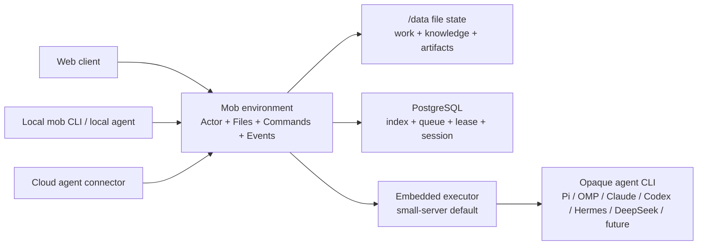

# Architecture: a file-native agent environment

## Product boundary

Mob is the environment in which people and agents work together. It is not an
agent framework, model router, skill runtime, or memory implementation.



Mob deliberately does not own an agent's harness, model choice, skills, prompt
framework, or private memory. Those are opaque implementation details of the
connected actor. The current built-in CLI drivers are compatibility connectors,
not the domain model.

## Four protocol primitives

1. **Actors** — stable identities for humans and agents.
2. **Files** — readable conversations, execution history, events, artifacts and knowledge.
3. **Commands** — message, select repository, delegate, steer, cancel and complete.
4. **Events** — normalized observable activity and terminal outcomes.

Every entry point uses the same authenticated HTTP surface. The web app uses a
session cookie; the external `mob` CLI uses the same scoped session as a Bearer
token. An active executor receives a short-lived Agent token carrying workspace,
conversation, hidden execution and run claims. Execution routes enforce those
claims, while shared knowledge is workspace-scoped and conversation visibility
follows Actor membership; it is not a strict one-run capability sandbox.

```text
mob login --server <url> --email <email> --password-stdin
mob chat list
mob chat new --kind direct --member @builder
mob chat send <conversation-id> "先帮我分析这个问题"
mob repo import https://github.com/owner/repository
mob repo use <conversation-id> <repository-id>
mob run watch <run-id>
mob knowledge search "writer lease"
```

## File layout

The workspace state lives under the persistent data volume:

```text
/data/state/workspaces/<workspace-id>/
├── workspace.json
├── actors/<actor-id>.json
├── agents/<actor-id>/profile.json
├── repositories/<repository-id>.json
├── documents/<document-id>.json
├── conversations/<conversation-id>/
│   ├── conversation.json
│   ├── members/<actor-id>.json
│   └── messages/<time>-<id>.md
├── knowledge/
│   ├── raw/                         immutable source material
│   ├── wiki/                        curated Markdown knowledge
│   ├── cache/                       disposable search projection
│   └── manifests/                   provenance and run context selections
└── tasks/<task-id>/                 hidden execution/admin state
    ├── task.json
    ├── delegations/<id>.json
    ├── runs/<run-id>/
    │   ├── run.json
    │   ├── attempts/<number>-<id>.json
    │   └── events/<sequence>-<id>.json
    ├── artifacts/<id>.json
    └── approvals/<id>.json
```

Messages keep their original Markdown body with one machine-readable metadata
header. Other records use stable JSON. Writes use a same-directory temporary
file and atomic rename. Runtime lease tokens, passwords, provider keys and other
operational secrets are not workspace files.

Secret-free CLI provider files live separately under `/data/agents/<actor-id>`.
They are generated from environment configuration and are not part of the
workspace replay ledger. The built-in mapping is deliberately per harness:
Pi/OMP/Hermes/DeepSeek Harness use the Router chat model, Claude Code uses an
Anthropic model alias, and Codex uses a Responses model.

In production, provider calls go through a run-token-authenticated local MobAI
proxy. The real Router key stays in the control process. CLI processes run under
a dedicated OS UID and temporarily own only the active execution checkout. They
cannot read control credential files, workspace ledgers, artifacts, or trusted
Git metadata. GitHub credentials are used only by control-plane clone/publish
commands after human approval.

Git has two deliberately separate locations. `/data/control/tasks/<task-id>` is
root-only and contains the trusted bare repository plus the exact materialized
base commit. `/data/tasks/<task-id>` is the Agent-owned working copy and its
`.git` directory is always treated as hostile input. The control plane never
runs Git against that `.git`. A clean task is rebuilt from a credential-free
bundle; a dirty task is preserved. Publication copies only ordinary files into
a fresh root-only checkout at the recorded base, rejects symlinks, special
files, secret-shaped names and common secret content, then commits and pushes
from that fresh checkout.

## File authority migration

The file protocol is the target authority for user-owned work. PostgreSQL stays
because it is a simple, mature way to implement authentication, idempotency,
search projections, queues and exclusive writer leases.

The migration is intentionally staged:

1. Backfill the complete current workspace into files on startup.
2. Persist every new message, run, event and artifact to files.
3. Keep API reads on the PostgreSQL projection while comparing it with file
   replay.
4. Validate and replay file-backed collaboration rows with `mob db rebuild`.
   Dry-run is the default; apply requires an exact workspace confirmation and an
   idle workspace. Operational auth, import-queue and lease tables are
   deliberately preserved. Agent connector profiles are replayed from files.
   See [File ledger replay](file-replay.md).
5. Prove disaster recovery together with a separate operational credential and
   connector backup before declaring files the complete production authority.

This avoids pretending that a best-effort dual write is already a completed
source-of-truth cutover.

## Built-in knowledge

The former MobWiki direction is absorbed into the environment and no separate
MobWiki service or repository is required.

- Uploaded Markdown is retained in `knowledge/raw/`.
- Agents or people curate durable pages in `knowledge/wiki/` through Mob commands.
- Search is a small rebuildable keyword index; no vector database is required.
- Before a run, Mob searches recent conversation text, selects bounded excerpts, and
  records exact paths and revisions in a context manifest.
- A later Curator automation can use the same ordinary commands. It does not get
  direct access to control-plane state or SCM credentials.

## Collaboration and execution

Conversation is the public collaboration object. It is either a direct chat or
a group; neither requires a Task or repository. A direct chat contains exactly
two actors; it stays ordinary for two humans and wakes the peer when that peer
is an Agent. A group message wakes only explicitly mentioned Agents; a message
without an Agent mention is ordinary chat. Every wake records its exact trigger
message. The Agent reads the same transcript and decides whether to answer,
clarify, or begin longer work.
Long work first acknowledges intent in chat and remains observable and
interruptible from the same conversation.

Repositories form an independent workspace list. A conversation is scratch by
default and can select or switch an active repository at any time. When a
message wakes an Agent, Mob creates a hidden execution record for the turn,
guardrails, budget and lease. It uses scratch for a conversational response, or
materializes the isolated worktree automatically when a repository was
selected. The worker treats the trigger message, relevant transcript, or a
delegation's bounded deliverable as the current instruction instead of replaying
a stale Task description. Legacy task-backed primary conversations remain
readable during migration but are not a separate user-facing chat type.

An agent can invoke another registered actor through `mob delegate`; the
environment launches or routes the receiving actor and records a separate run.
Agents never invoke another vendor CLI directly. Depth, fan-out, writer leases,
time and run budgets remain server-enforced safety limits.

The first deployment stays one Fastify process, one embedded executor,
PostgreSQL and one `/data` volume. No Redis, Kubernetes, Temporal, workflow DAG,
MobWiki sidecar or Daytona control plane is required.

Remote executors will use outbound claim/heartbeat/event/result operations.
SSH PTY and localhost forwarding from Mob Sandbox are useful optional connector
ideas, but its privileged Daytona/root/Traefik infrastructure is not part of the
core environment.

## Git and security boundary

- Fewer than ten administrator-allowlisted trusted repositories.
- One writable workspace lease per hidden execution scope.
- Agent subprocesses never receive SCM write credentials.
- Agents stop at task-checkout changes and artifacts. After accepting the
  result, a human may explicitly publish a new `mob/` branch; merge and deploy
  remain outside Mob.
- A dedicated Agent UID, root-only control repository, untrusted task copy and
  local provider proxy protect control credentials. This is still a
  trusted-repository, small-team boundary rather than a hostile multi-tenant
  sandbox.

The full boundary decision is recorded in
[ADR-001](adr/001-file-native-agent-environment.md).
