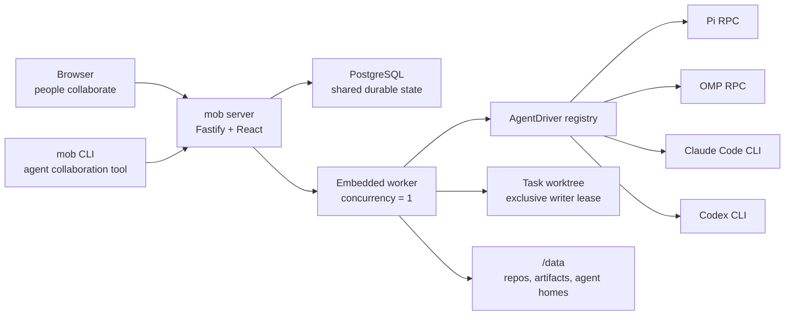

# Architecture: single-server collaboration core

## The product boundary

Mob Agent Crew is a collaboration system with an execution capability, not an execution platform with a chat screen.



## Shared collaboration protocol

Humans and agents are represented by the same `Actor` identity. A task is a durable thread rather than a transient agent run.

An active agent receives a scoped run token and these commands:

```text
mob context                         read task, messages, participants, artifacts
mob say "message"                   post progress or a result as the current agent
mob delegate @agent "deliverable"  create a bounded handoff
mob artifact add <path>             publish an explicit output
mob done "summary"                  finish the current run
```

The receiving agent is launched by the platform. Agents never shell out to another vendor CLI directly.

## Core records

```text
Workspace
  ├─ Actor (human | agent)
  │    └─ AgentProfile (owner, driver, role, credential home)
  ├─ Repository (allowlisted local/remote source)
  └─ Task
       ├─ Message
       ├─ Delegation (from actor/run -> agent, bounded depth)
       ├─ Run (driver attempt and normalized events)
       ├─ Artifact
       └─ Approval (human-only external action)
```

## CLI driver contract

Drivers expose real capabilities instead of a lowest-common-denominator fiction:

```ts
type DriverCapabilities = {
  streaming: boolean;
  steer: boolean;
  followUp: boolean;
  resume: boolean;
  nativeCancel: boolean;
};

interface AgentDriver {
  id: string;
  probe(profile: AgentProfile): Promise<DriverProbe>;
  start(input: DriverRunInput): Promise<DriverRun>;
}
```

- Pi and OMP are duplex RPC drivers.
- Claude Code and Codex begin as one-shot JSONL drivers.
- A generic process manifest covers future one-shot CLIs; advanced runtimes add a small TypeScript driver.

## Git collaboration

- A task has one branch and one worktree.
- Only one active run may hold the write lease.
- A read-only reviewer gets an immutable Git revision plus prior artifacts.
- Before a handoff that changes the writer, the platform snapshots the current diff/commit state.
- The platform, not the agent, computes the final diff and test record.
- Only a human approval can trigger the publisher, and the publisher is the only component with SCM write credentials.

## Single-server now, cluster later

The first deployment runs API and worker in one process and stores disposable worktrees and artifacts under `/data`. PostgreSQL is the only coordination dependency.

When actual queue delay justifies it:

1. Run `mob serve` without an embedded worker.
2. Run one or more `mob worker` processes against the same PostgreSQL database.
3. Move artifacts to S3-compatible storage.
4. Keep workspaces node-local and lease runs through PostgreSQL.

No API, task, message, delegation, or driver contract changes are required.

## Explicit security boundary

The first release accepts only administrator-allowlisted, trusted repositories. Process isolation, per-agent homes, environment filtering, worktree leases, and credential separation reduce accidents; they do not make arbitrary repository code safe.

