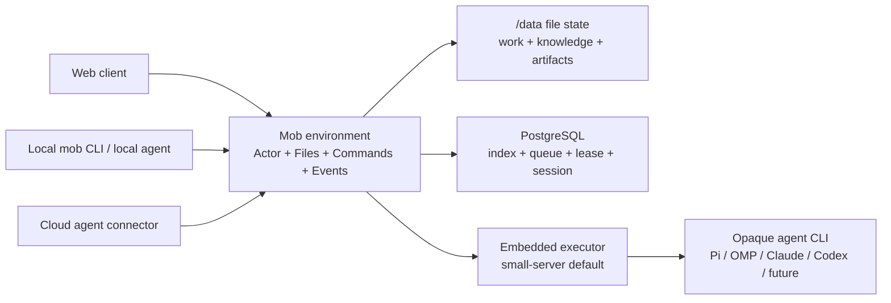

# Architecture: a file-native agent environment

## Product boundary

Mob is the environment in which people and agents work together. It is not an
agent framework, model router, skill runtime, or memory implementation.



Mob deliberately does not own an agent's harness, model choice, skills, prompt
framework, or private memory. Those are opaque implementation details of the
connected actor. The current built-in CLI drivers are compatibility connectors,
not the domain model.

## Four protocol primitives

1. **Actors** — stable identities for humans and agents.
2. **Files** — readable work history, tasks, events, artifacts and knowledge.
3. **Commands** — message, invoke, delegate, cancel, publish and complete.
4. **Events** — normalized observable activity and terminal outcomes.

Every entry point uses the same authenticated HTTP surface. The web app uses a
session cookie; the external `mob` CLI uses the same scoped session as a Bearer
token; an active executor receives a short-lived token restricted to one run and
one task.

```text
mob login --server <url> --email <email> --password-stdin
mob task list
mob chat send <task-id> "@builder investigate this"
mob agent invoke <task-id> reviewer "review the result"
mob run watch <run-id>
mob knowledge search "writer lease"
```

## File layout

The workspace state lives under the persistent data volume:

```text
/data/state/workspaces/<workspace-id>/
├── workspace.json
├── actors/<actor-id>.json
├── repositories/<repository-id>.json
├── documents/<document-id>.json
├── knowledge/
│   ├── raw/                         immutable source material
│   ├── wiki/                        curated Markdown knowledge
│   ├── cache/                       disposable search projection
│   └── manifests/                   provenance and run context selections
└── tasks/<task-id>/
    ├── task.json
    ├── messages/<time>-<id>.md
    ├── delegations/<id>.json
    ├── runs/<run-id>/
    │   ├── run.json
    │   ├── attempts/<number>-<id>.json
    │   └── events/<sequence>-<id>.json
    ├── artifacts/<id>.json
    └── approvals/<id>.json
```

Messages keep their original Markdown body with one machine-readable metadata
header. Other records use stable JSON. Writes use a same-directory temporary
file and atomic rename. Runtime lease tokens, passwords, provider keys and other
operational secrets are not workspace files.

## File authority migration

The file protocol is the target authority for user-owned work. PostgreSQL stays
because it is a simple, mature way to implement authentication, idempotency,
search projections, queues and exclusive writer leases.

The migration is intentionally staged:

1. Backfill the complete current workspace into files on startup.
2. Persist every new message, run, event and artifact to files.
3. Keep API reads on the PostgreSQL projection while comparing it with file
   replay.
4. Prove that an empty projection can be rebuilt solely from files.
5. Only then declare files the production authority and make replay the recovery
   path.

This avoids pretending that a best-effort dual write is already a completed
source-of-truth cutover.

## Built-in knowledge

The former MobWiki direction is absorbed into the environment and no separate
MobWiki service or repository is required.

- Uploaded Markdown is retained in `knowledge/raw/`.
- Agents or people curate durable pages in `knowledge/wiki/` through Mob commands.
- Search is a small rebuildable keyword index; no vector database is required.
- Before a run, Mob searches recent task text, selects bounded excerpts, and
  records exact paths and revisions in a context manifest.
- A later Curator automation can use the same ordinary commands. It does not get
  direct access to control-plane state or SCM credentials.

## Collaboration and execution

An agent can invoke another registered actor through `mob delegate`; the
environment launches or routes the receiving actor and records a separate run.
Agents never invoke another vendor CLI directly. Depth, fan-out, writer leases,
time and run budgets remain server-enforced safety limits.

The first deployment stays one Fastify process, one embedded executor,
PostgreSQL and one `/data` volume. No Redis, Kubernetes, Temporal, workflow DAG,
MobWiki sidecar or Daytona control plane is required.

Remote executors will use outbound claim/heartbeat/event/result operations.
SSH PTY and localhost forwarding from Mob Sandbox are useful optional connector
ideas, but its privileged Daytona/root/Traefik infrastructure is not part of the
core environment.

## Git and security boundary

- Fewer than ten administrator-allowlisted trusted repositories.
- One writable workspace lease per task.
- Agent subprocesses never receive SCM write credentials.
- Only a human approval may publish normal code repository changes.
- Process and workspace separation reduce accidents; the current small-server
  deployment is not a hostile multi-tenant sandbox.

The full boundary decision is recorded in
[ADR-001](adr/001-file-native-agent-environment.md).
